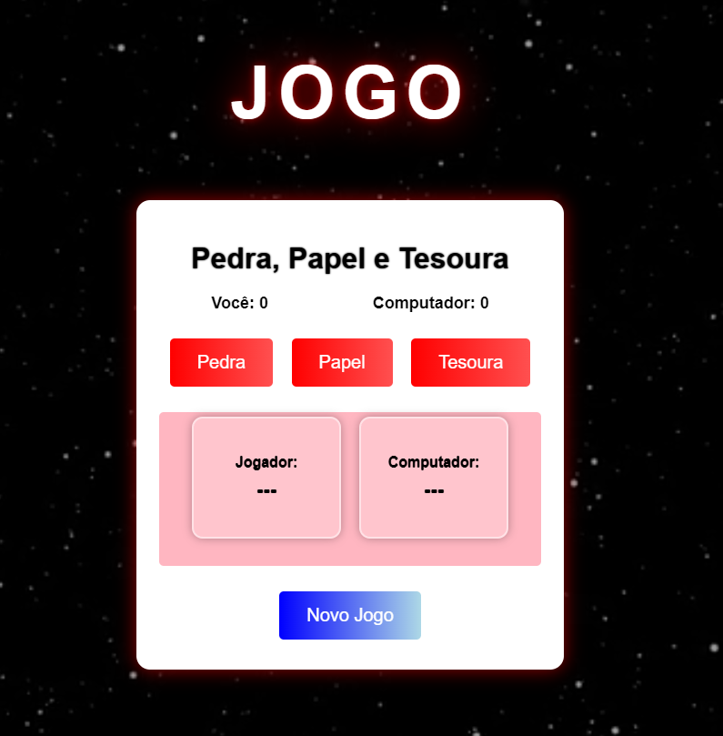

🪨📄✂️ Jogo Pedra, Papel e Tesoura

Um jogo simples e divertido de Pedra, Papel e Tesoura, desenvolvido com HTML, CSS e JavaScript, com visual moderno, efeitos visuais e vídeo de fundo.

---

📷 Interface do Projeto

---

🎮 Demonstração

O jogador escolhe uma das três opções e o computador faz uma escolha aleatória. O placar registra vitórias, derrotas e empates.

O jogo possui:

Vídeo de fundo com efeito de overlay

Animações nos botões

Placar dinâmico

Caixa com escolhas de jogador e computador

Botão de reiniciar partida

---

🛠️ Tecnologias Utilizadas

HTML5: Estrutura da página

CSS3: Estilização e design (inclui efeitos de sombra, gradientes, blur e animações)

JavaScript: Lógica do jogo (escolhas, placar e regras)

---

📌 Funcionalidades
✔ Escolha do Jogador

Botões interativos permitem escolher Pedra, Papel ou Tesoura.

✔ Escolha Aleatória do Computador

Gerada com Math.random().

✔ Exibição das Escolhas

Mostra o que o jogador e o computador escolheram.

✔ Resultado do Round

Exibe se o jogador ganhou, perdeu ou empatou.

✔ Sistema de Placar

Pontuação atualizada automaticamente.

✔ Reiniciar Jogo

Zera o placar e limpa as escolhas.

---

🔧 Melhorias Futuras

Adicionar efeitos sonoros

Criar modo melhor de 3 / melhor de 5

Ranking de vitórias

Responsividade aprimorada para mobile

Animações nas caixas de escolha

---

🚀 Como Executar

Baixe ou clone o repositório:

git clone https://github.com/seu-usuario/seu-repositorio.git

Certifique-se de que os arquivos abaixo estejam na mesma pasta:

index.html

style.css

script.js

video.mp4

Abra o arquivo index.html em qualquer navegador.

